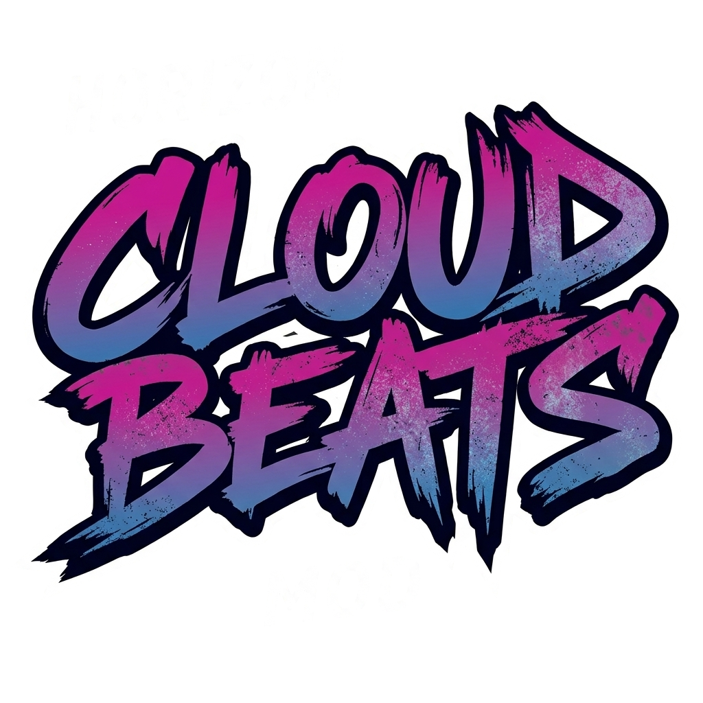
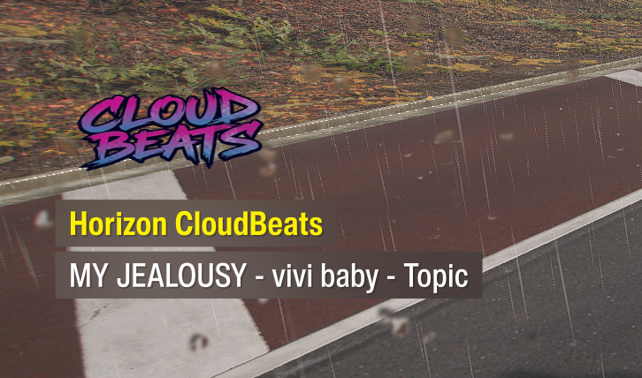
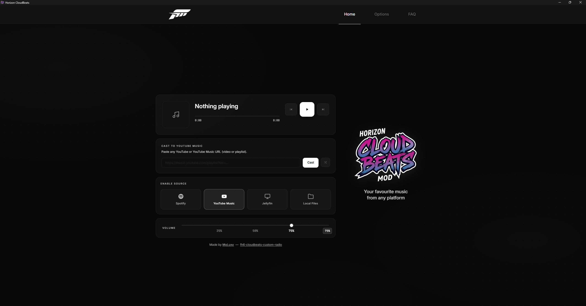

<p align="center"><a href="https://github.com/MyLuxy/fh6-cloudbeats-custom-radio"></a></p>
<p align="center"><em>Your music. Your stations. Inside Forza Horizon 6.</em></p>

<p align="center">
  <a href="https://github.com/MyLuxy/fh6-cloudbeats-custom-radio/blob/main/LICENSE"></a>
  <a href="https://www.microsoft.com/windows"></a>
  <a href="https://github.com/g0ldyy/fh6-universal-radio"></a>
</p>

Horizon CloudBeats is an open-source radio mod for **Forza Horizon 6** that turns the in-game radio into your personal station. Stream from **Spotify**, **YouTube / YouTube Music**, your own **Jellyfin** server, or **local files** all controlled from a clean dashboard. Audio is routed through the game's radio bus, so it fades with menus and follows the in-game volume just like every built-in station.

<table align="center">
  <tr>
    <td></td>
    <td></td>
  </tr>
</table>

<br>

## Supported sources

<p align="center">
  <a href="https://www.spotify.com"></a>
  &nbsp;&nbsp;&nbsp;&nbsp;
  <a href="https://www.youtube.com"></a>
  &nbsp;&nbsp;&nbsp;&nbsp;
  <a href="https://music.youtube.com"></a>
  &nbsp;&nbsp;&nbsp;&nbsp;
  <a href="https://jellyfin.org"></a>
</p>

| Source | What you get |
|---|---|
| **Spotify** | Paste any public playlist, album, or track link. No Premium and no login required — tracks are matched and streamed via YouTube. |
| **YouTube / YouTube Music** | Paste any video, playlist, or YT Music URL straight from the dashboard. |
| **Jellyfin** | Stream playlists or your favorites from your own Jellyfin media server. |
| **Local Files** | Point it at any folder. MP3 / FLAC / WAV / OGG play out of the box; M4A / AAC / OPUS / WMA and others play with `ffmpeg`. |

<br>

## What's new in this fork

Horizon CloudBeats is a fork of [FH6 Universal Radio](https://github.com/g0ldyy/fh6-universal-radio), rebuilt to be faster and more reliable. Main changes in this version:

- **Spotify support added** — a new source: play public Spotify playlists, albums, and tracks with no Premium and no login.
- **New Website UI** — new UI for the web and webapp dashboard.
- **Standalone desktop app** — a native companion app (`HorizonCloudBeats.exe`, included in `dist/`) that opens the dashboard in its own window and connects automatically when the game launches, so you don't need a browser (autodownloader for yt-dlp, ffmpeg and deno).
- **Optimized codebase** — cleaner, more efficient code for smoother playback and lower overhead.
- **Equalizer fixed** — the 5-band EQ was broken in the original build; it now works correctly and applies in real time.
- **In-game radio name fixed** — the station used to show the song title instead of the station name, with a popup on every track change. That's fixed, and since some people liked the now-playing popup, it's now an optional toggle in Settings (off by default).

<br>

## Features

- Four sources in one mod: Spotify, YouTube / YouTube Music, Jellyfin, and local files — switch on the fly.
- Native in-game integration: audio runs through FH6's radio bus, fading with menus and following the in-game volume.
- Standalone desktop app or browser: open the included `HorizonCloudBeats.exe`, or use any browser at `http://localhost:8420` — reachable from any device on your network.
- Race start action: on race begin, advance to the next track, restart the current one, or leave it playing.
- Quick station skip: flick the radio knob away and back within 1 second to skip the current track.
- Loudness normalization: keeps volume consistent across tracks.
- 5-band equalizer: 60 Hz / 250 Hz / 1 kHz / 4 kHz / 12 kHz, ±6 dB per band, applied at 48 kHz before audio reaches the game.
- Optional now-playing banner on every track change.

<br>

## Install

1. Download the latest release ZIP from the [Releases](https://github.com/MyLuxy/fh6-cloudbeats-custom-radio/releases) page (or build it yourself — see below).
2. Close FH6.
3. Extract the ZIP into your Forza Horizon 6 install folder (next to `forzahorizon6.exe`). Overwrite when prompted.
4. Launch the game. In **Audio settings**, set **Radio DJ = Off** and **Streamer Mode = On**.
5. Cycle through the radio stations until you land on Horizon CloudBeats.
6. Open the included `HorizonCloudBeats.exe`, or go to <http://localhost:8420> in a browser. From another device on the same network, use your PC's local IP (e.g. `http://192.168.1.42:8420`) — run `ipconfig` in a Command Prompt to find it.

### Setup for Spotify and YouTube

Spotify and YouTube playback share the same engine and require three external tools. Open a **Command Prompt** and run:

```
winget install yt-dlp.yt-dlp
winget install Gyan.FFmpeg
winget install DenoLand.Deno
```

Then restart the game.

- `yt-dlp` and `ffmpeg` can also be set explicitly in the dashboard under **Settings** if you prefer a manual install.
- Private or age-restricted YouTube content needs a Netscape `cookies.txt` exported from your browser (use an extension like **Get cookies.txt LOCALLY**), then set the path under **Settings → YouTube Music**.

<br>

## Uninstall

- Delete `version.dll` from the game directory.
- Delete the `fh6-radio` folder.
- Verify game files through Steam / Xbox / Microsoft Store to restore the patched assets.

<br>

## Build from source

The output is always a Windows `version.dll`. You also need the radio-station media overlay from any existing radio mod ZIP — it's mod-agnostic, but the assets are modified copies of game files, so they aren't shipped in this repo.

### Windows

Requires **Visual Studio 2022+** with the *Desktop development with C++* workload (CMake is bundled).

```powershell
.\scripts\get-deps.ps1                                                  # one-time: header-only deps
.\scripts\build.ps1                                                     # compile + stage dist\
.\scripts\fetch-media.ps1 -Source "C:\path\to\radio-mod.zip"            # radio-station overlay
.\scripts\install.ps1 -GameDir "C:\XboxGames\Forza Horizon 6\Content"   # copy into game
```

### Linux (cross-compile to Windows)

Requires **CMake** and **llvm-mingw** (the Clang-based MinGW-w64 toolchain, since the codebase uses MSVC SEH which GCC-mingw doesn't implement). On Arch: `sudo pacman -S llvm-mingw cmake`. On other distros, grab a release from [mstorsjo/llvm-mingw](https://github.com/mstorsjo/llvm-mingw/releases) and unpack it under `/opt/llvm-mingw` (the build script auto-detects that path).

```bash
./scripts/get-deps.sh                                                   # one-time: header-only deps
./scripts/build.sh                                                      # compile + stage dist/
./scripts/fetch-media.sh /path/to/radio-mod.zip                         # radio-station overlay
./scripts/install.sh ~/.steam/steam/steamapps/common/ForzaHorizon6      # copy into game (Proton prefix)
```

<br>

## Troubleshooting

| Symptom | Fix |
|---|---|
| Dashboard says bridge offline | Media overlay not installed. Re-run `install.ps1` with `dist\media\` present. |
| New radio station doesn't show in-game | **Audio → Streamer Mode** is off. Turn it on, restart the game. |
| Game crashes on launch | Antivirus quarantined `version.dll`. Add an exclusion for the game folder. |
| Local files don't play | No `music_dir` set, or the folder only has unsupported formats. Set one from the dashboard. |
| `[local] failed to open ... .m4a` (or `.opus`, `.aac`, ...) | The built-in decoder handles MP3/FLAC/WAV/OGG only; other formats are routed through `ffmpeg`. Install it (`winget install Gyan.FFmpeg`) and either put it on `PATH` or set the path under **Settings → General → ffmpeg path**. |
| Spotify / YouTube produces no audio | Check `%TEMP%\fh6-stderr.log` (helper-process stderr lands there). Usually missing yt-dlp/ffmpeg/deno, expired cookies, or geo/format restrictions. |
| Jellyfin cast returns "fetch failed" (502) | Check server URL, API key, and user ID under **Settings → Jellyfin**, that the playlist ID exists, and that the server is reachable. Jellyfin transcodes to PCM via `ffmpeg`, so the configured ffmpeg path must be valid. |

<br>

## License

Released under the [GNU General Public License v3.0](LICENSE). You're free to use, modify, and redistribute the code; forks and derivatives must remain GPLv3 and credit the original project.

<br>

## Credits

Horizon CloudBeats is a fork of [FH6 Universal Radio](https://github.com/g0ldyy/fh6-universal-radio) by g0ldyy, used and modified under the terms of the GPLv3. All original authorship and attribution is retained as required by the license.

<br>

## Disclaimer

Unofficial fan-made mod. Not affiliated with, endorsed by, or connected to Turn 10 Studios, Playground Games, Xbox Game Studios, Microsoft, Google, YouTube, Spotify, or Jellyfin (Jellyfin LLC). All trademarks belong to their respective owners. Use at your own risk.
